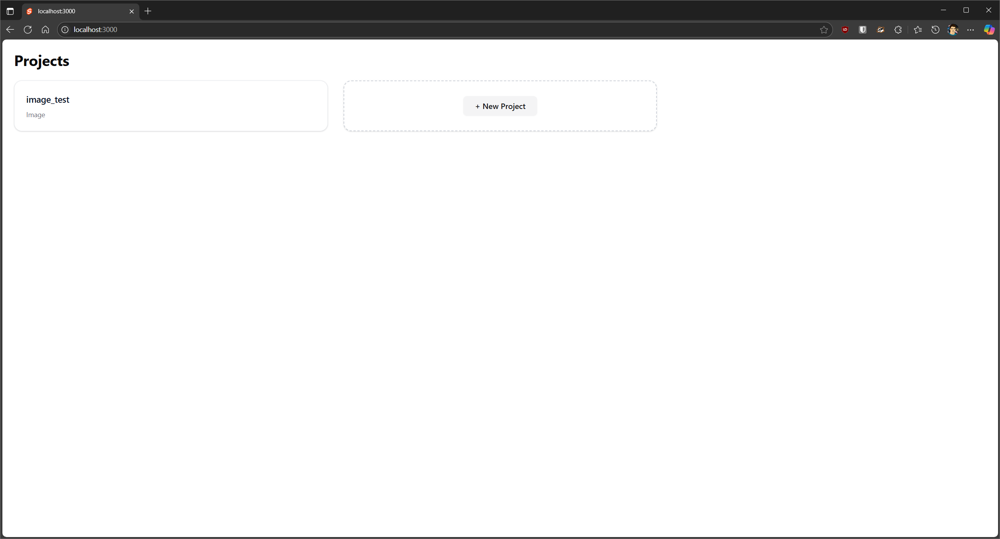
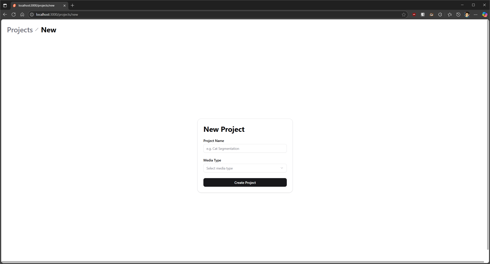
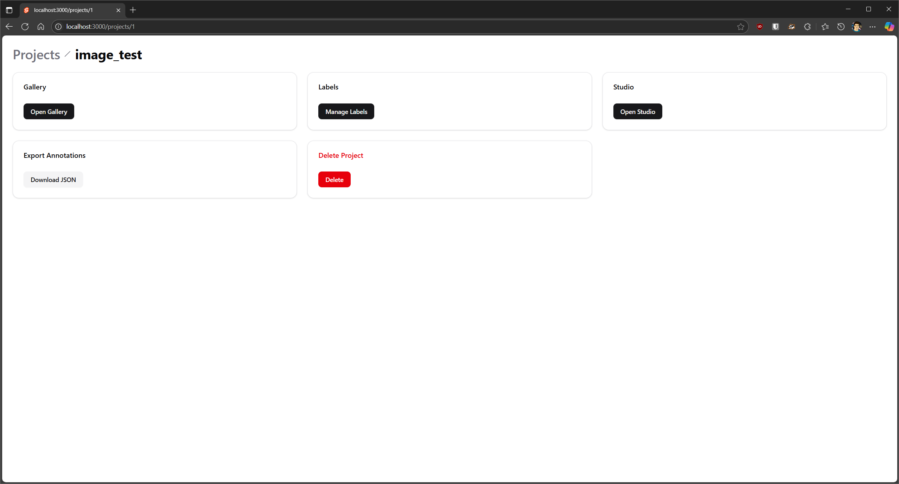
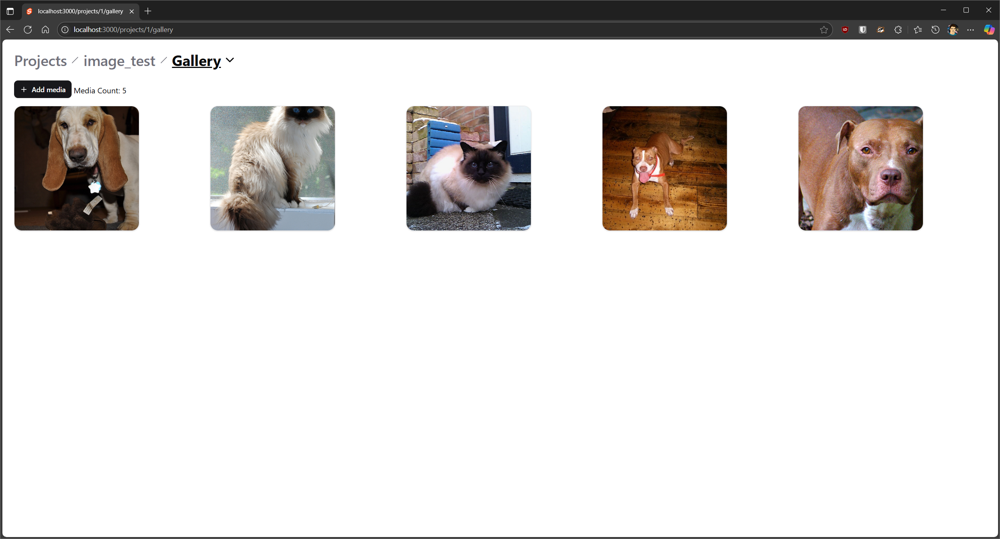
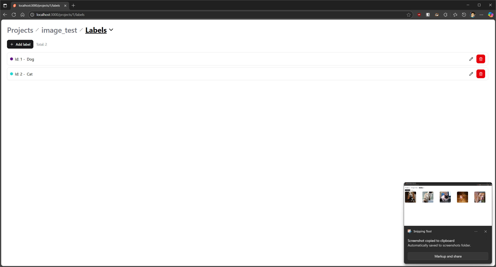
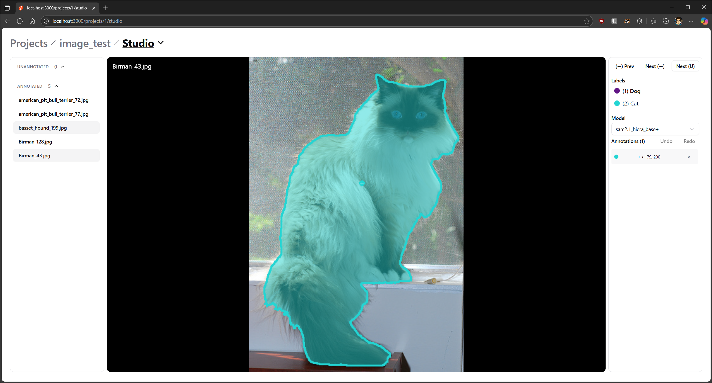

# ECE551-Video-Seg

Accurate segmentation masks are essential for training modern computer-vision models, yet creating them by hand remains time-consuming and error-prone.
ECE551-Video-Seg is a browser-based annotation application that aims to reduce this bottleneck by combining a conventional point-and-click user interface with **Meta’s Segment-Anything Model v2.1 (SAM 2.1)** running on a RESTful server.

The core workflow is as follows:

1. **User input** – The annotator selects a label and clicks once (or draws a box) on the object of interest.
2. **Model inference** – The backend feeds the image and prompt into SAM 2.1, which returns an initial mask in a few hundred milliseconds on a GPU.
3. **Interactive refinement** – The annotator can add positive or negative points to correct errors; each new prompt instantly updates the mask.
4. **Post-processing and export** – Masks are stored per image and exported in **COCO** format (JSON + RLE) for direct use in training pipelines.

Compared with traditional polygon tools, the system offers three advantages:

| Aspect | Polygon/Scribble tools | **ECE551-Video-Seg** |
|--------|-----------------------|----------------------|
| Time per image | Minutes (complex objects) | Tens of seconds (single prompt, few refinements) |
| Consistency | Variable between annotators | Deterministic model output, fewer systematic errors |
| Learning curve | Requires manual precision | Point-and-click; mask refinement is incremental |

The application is delivered as two Docker containers—one serving a Svelte front-end, the other a FastAPI back-end with PyTorch. GPU acceleration is optional but strongly recommended for practical throughput.

## 1 Main Features

| Category | Description |
|----------|-------------|
| Media management | Upload, list and preview images (video support is planned). Media is stored per project. |
| Label management | Add, edit and delete labels. Each label is associated with a color. |
| Annotation studio | Prompt-based mask generation using SAM 2.1. Supports multiple labels, multiple prompts, undo/redo and keyboard shortcuts. |
| Export | One-click COCO JSON export (images plus RLE masks). |

## 2 Screenshots

### 2.1 Project Selector / Creation




### 2.2 Project Dashboard



### 2.3 Media Gallery



### 2.4 Label Manager



### 2.5 Annotation Studio



## 3  System Requirements

| Component | Minimum | Recommended |
|-----------|---------|-------------|
| GPU | not required (CPU mode) | NVIDIA GPU, ≥ 8 GB VRAM, CUDA 12.8 |
| CPU | 4 cores | 8 cores |
| RAM | 8 GB | 16 GB or more |
| Disk | 30 GB free | 50 GB free |
| OS | Linux (Debian 12 tested), macOS, Windows 11 | Ubuntu 22.04 LTS |
| Docker | 28.0 or later | 28.0 or later with NVIDIA Container Toolkit |

## 4  Installation with Docker Compose

Two compose profiles are provided: **gpu** and **cpu**.

### 4.1 GPU profile
Speeds up inference using a NVidia GPU.

1. Install Docker Desktop or Docker Engine with Compose.
2. Install the NVIDIA Container Toolkit.
   *Windows users:* first enable WSL 2, then install Docker with the WSL 2 backend, and finally install the NVIDIA toolkit.
   Refer to:
   * <https://learn.microsoft.com/windows/wsl/install>
   * <https://docs.docker.com/desktop/features/wsl/>
   * <https://learn.microsoft.com/windows/ai/directml/gpu-cuda-in-wsl>
   * <https://docs.nvidia.com/datacenter/cloud-native/container-toolkit/install-guide.html>
3. Clone and start the containers:
```bash
git clone --recursive https://github.com/briyoon/ECE551-Video-Seg.git
cd ECE551-Video-Seg
docker compose --profile gpu up --build -d
```
4. Open http://localhost:3000.

### 4.2 CPU profile (slow)
Processing on CPU is significantly slower.
1. Install Docker Desktop or Docker Engine with Compose.
2. Clone and start the containers:
```bash
git clone --recursive https://github.com/briyoon/ECE551-Video-Seg.git
cd ECE551-Video-Seg
docker compose --profile cpu up --build -d
```
3. Open http://localhost:3000.

## 5 Detailed Workflow

The following section walks through every user-visible step in the current image-annotation workflow, and pairs each UI action with the relevant client-side component and back-end API call.
The same structure will apply to video as soon as timeline support is finished (see *Future goals*).

### 5.1 Project Home (“Projects”)

| Action | UI element (component) | Back-end call | Notes |
|--------|-----------------------|---------------|-------|
| Display list | `<Card>` tiles rendered by **Projects.svelte** (snippet 1) | `GET /api/v1/projects` *(handled in load function; not in snippet)* | Projects are passed to child components via Svelte context (`getContext('projectlist')`). |
| Create project | **“+ New Project”** button | — | Navigates to `/projects/new`. |

### 5.2 Create Project

| Action | UI element (component) | Back-end call | Validation / state |
|--------|-----------------------|---------------|---------------------|
| Enter name + select media type | `<Input>` & `<Select>` in **NewProject.svelte** (snippet 2) | — | Two-way bound to `name` and `media_type`. |
| Submit form | **Create Project** `<Button>` | `POST /api/v1/projects` → `createProjectApiV1ProjectsPost` | Disabled while `submitting=true`. |
| Success | Toast “Project created” (svelte-sonner) | — | `goto('/projects/{id}')` on success. |

### 5.3 Project Dashboard

Layout reference: `project.png`

| Tile | UI element | Destination | Purpose |
|------|------------|-------------|---------|
| **Gallery** | `<Button href="/gallery">` | Thumbnail view, upload / delete media. |
| **Labels** | `<Button href="/labels">` | Manage class list and colours. |
| **Studio** | `<Button href="/studio">` | Main annotation canvas. |
| **Export Annotations** | Secondary `<Button>` | Triggers `GET /api/v1/projects/{pid}/export` | Returns ZIP containing `coco.json` + mask files. |
| **Delete Project** | Destructive `<Button>` | `DELETE /api/v1/projects/{pid}` | Confirmation dialog then redirect to `/`. |

### 5.4 Label Manager

Layout reference: `labels.png`

| Action | Component (snippet 3) | API |
|--------|----------------------|-----|
| List labels | `listLabelsApiV1ProjectsPidLabelsGet` on mount (`refreshLabels()`). |
| Add label | “Add label” modal → `POST` | `createLabelApiV1ProjectsPidLabelsPost` |
| Edit label | Inline rename / recolour → `PATCH` | `updateLabelApiV1ProjectsPidLabelsLidPatch` |
| Delete label | Trash icon → confirm → `DELETE` | `deleteLabelApiV1ProjectsPidLabelsLidDelete` |

Internally each label is an object `{ id, name, color }`. Edits update the local `labels` array to keep the UI reactive.

### 5.5 Gallery / Media Manager

Layout reference: `gallery.png`

| Action | UI logic (snippet 4) | API |
|--------|---------------------|-----|
| Lazy grid render | `media.slice(0, visible)` with **IntersectionObserver** | — |
| Add media | “Add media” dialog → drag-and-drop or file picker | `POST /api/v1/projects/{pid}/media` |
| Preview full‐size | Click card → `<Dialog>` shows image/video | Static file route `/api/v1/projects/{pid}/media/{mid}` |
| Delete media | Trash icon in preview | `DELETE /api/v1/projects/{pid}/media/{mid}` |

*Accepted formats* are enforced on the client (`isValidFile`) and by the server:
- Images : `image/png`, `image/jpeg`
- Video  : `video/mp4`

### 5.6 Annotation Studio — Detailed Step-by-Step

This section expands the “Studio” step of the workflow and explains how each interaction is wired to the front-end component logic and the related API calls.

---

#### 5.6.1  Screen layout

| Region | DOM element(s) | Purpose |
|--------|----------------|---------|
| **Left sidebar** | `<aside>` (class `w-[270px]`) with two `Collapsible` lists | Navigate between *unannotated* and *annotated* media items. Each entry is a `<Button>` that sets `selected` via `selectMedia(item)`. |
| **Centre viewer** | `<main>` (class `relative flex-1`) | Displays the current image (or future video). Handles mouse events for adding / deleting prompts. Contains two overlay canvases: the static mask + prompt canvas (`annCanvas`) and the image/video element itself (`imgEl` or `<video>`). |
| **Right toolbar** | Second `<aside>` | Label selector, model selector, prompt list, undo / redo buttons, navigation shortcuts. |
| **Header** | `<ProjectNav>` breadcrumb | Shows project hierarchy and highlights active “Studio” route. |

---

#### 5.6.2  Data flow on initial load

1. **`onMount()`**
   ```ts
   refreshMedia();     // GET /media
   refreshModels();    // GET /models
   refreshLabels();    // GET /labels
   eventStream = getEventStream(); // open SSE /events
*Result*: sidebars are populated; the first media item becomes selected.

2. Media selection (selectMedia(item))
- Updates `selected`.
- Calls `refreshPrompts()` → `GET /prompts?media_id=…`.
- Calls `refreshAnnotations()` → `GET /annotations/image/{mid}`.
- Resets zoom / pan; redraws overlay.

#### 5.6.3 Adding a prompt (positive / negative)

| User gesture | Code path | HTTP call |
| --- | --- | --- |
| Left-click | `onclick` handler in `<main>` → `addPrompt(ix, iy, true)` | `POST /prompts/image` (body: click_label = 1) |
| Ctrl + Left-click | same → `addPrompt(ix, iy, false)` | `click_label = 0` |

addPrompt pushes a copy of the current prompt list to undoStack, clears redoStack, then sends the request.
If the backend returns { detail: "queued" }, the media-ID is put in the queued Set to show a spinner until the mask is computed. Server-side completion is signalled via Server-Sent Events on /events; the handler:

```ts
if (msg.event === 'annotations_updated') {
    queued.delete(msg.media_id);
    refreshPrompts();
    refreshAnnotations();
    refreshMedia();
}
```

#### 5.6.4 Deleting the nearest prompt

| Gesture |	Code | HTTP |
| --- | --- | --- |
| Right-click | `auxclick` handler → `deleteNearestPrompt(ix, iy)` | `DELETE /prompts/image/{aid}` |

`deleteNearestPrompt` finds the prompt with minimum Euclidean distance in pixel space and issues a `DELETE`. The result updates the same caches and overlay.

#### 5.6.5 Mask rendering pipeline

1. Mask retrieval – `refreshAnnotations()` calls
`GET /projects/{pid}/annotations/image/{mid}` which returns an array:

```json
[
  {
    "label_id": 2,
    "mask_rle": "27 3 32 5 …",
    …
  },
  …
]
```
2. RLE decoding (`decodeRle`) – converts the COCO “counts” string into a `Uint8Array` mask.

3. Compositing (`drawMasks`)
- Creates a scratch ImageData.
- Fills the alpha channel to 128 for interior pixels, 255 for dilated boundary (pseudo-outline).
- Uses label colour (labels[].color) for RGB.

4. Display – Scratch canvas is drawn onto `annCanvas`, then prompt dots are over-painted.

All transforms are applied via the 2-D canvas transform so the overlay stays aligned with the  element regardless of resize or device-pixel ratio.

#### 5.6.6 Keyboard shortcuts
| Key | Function | Implementation |
| --- | --- | ---
| 1 … 9 | Switch active label	| handleKey: numeric keys index into labels array. |
| ← / →	| Previous / next media |	prevImage() / nextImage() |
| U	| Next unannotated media |	nextUnannotated() |
Ctrl+Z	| Undo prompt change	| pops undoStack → pushes to redoStack |
Ctrl+Y	| Redo prompt change	| inverse of undo |

#### 5.6.7 Model selection
- Right toolbar `<Select>` lists available model IDs returned by GET /models.
- When the user changes selectedModelId, subsequent addPrompt() calls include it via ?model_key=….
- The server loads the corresponding SAM 2.1 checkpoint on first use and re-runs inference for that prompt.

#### 5.6.8 Undo / redo stacks
- Both stacks store deep copies (JSON.stringify/parse) of the prompts array only.
- Annotation pixels are not stored; masks are always requested fresh from the server. This prevents large memory use and guarantees consistency with server state.

#### 6.7.9 Failure handling
- Each API call is wrapped with a toast message on failure (toast.error).
- Network errors (non-2xx) are printed to console.error and surfaced to the user.

### 5.6 Export
- Download JSON on the dashboard calls exportProject() (snippet 3).
- FastAPI streams a ZIP archive: coco.json + mask PNGs (or RLE only, based on settings).
- The browser creates a blob URL and triggers a download with the suggested filename project_{pid}.zip.

### 5.7 Deletion
Project-level deletion removes:
- Database records (project, labels, media, masks).
- On-disk media and mask files under DATA_DIR/{pid}.
Confirmation is handled on the client; irreversible action is performed by DELETE /api/v1/projects/{pid}.

## 6 Quick Evaluation

A small-scale study was conducted with the Oxford-IIIT Pet datasets. Both time and accuracy metrics were studied. A subset of 50 cats and 50 dogs were used, with even class distribution.

| Metric | Manual Reference | ECE551-Video-Seg | Delta |
| ----- | ----- | ----- | ----- |
| Annotation Time | ? | ? | ? |
| Mean IoU | N/A | ? | ? |
| Mean Dice | N/A | ? | ? |

## 7 Future Goals

- Video support with timeline navigation and cached batch inference.
- Integration of an object-detection model to generate initial prompts automatically.
- Tools to further refine inital SAM2 annotations.
- Torch-TensorRT engine support for faster inference on compatible GPUs.